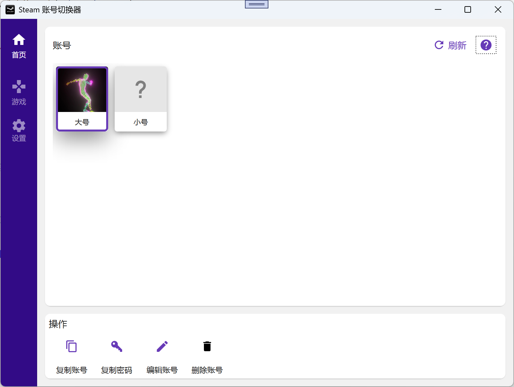
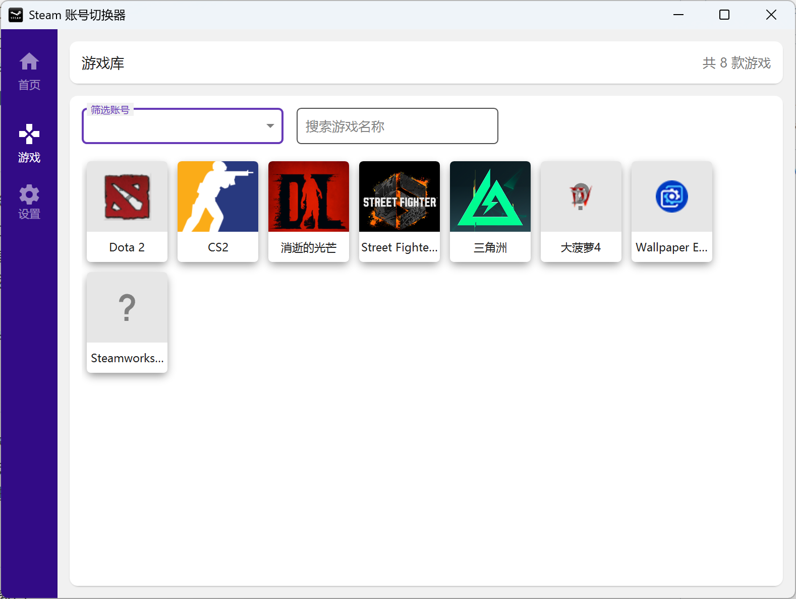
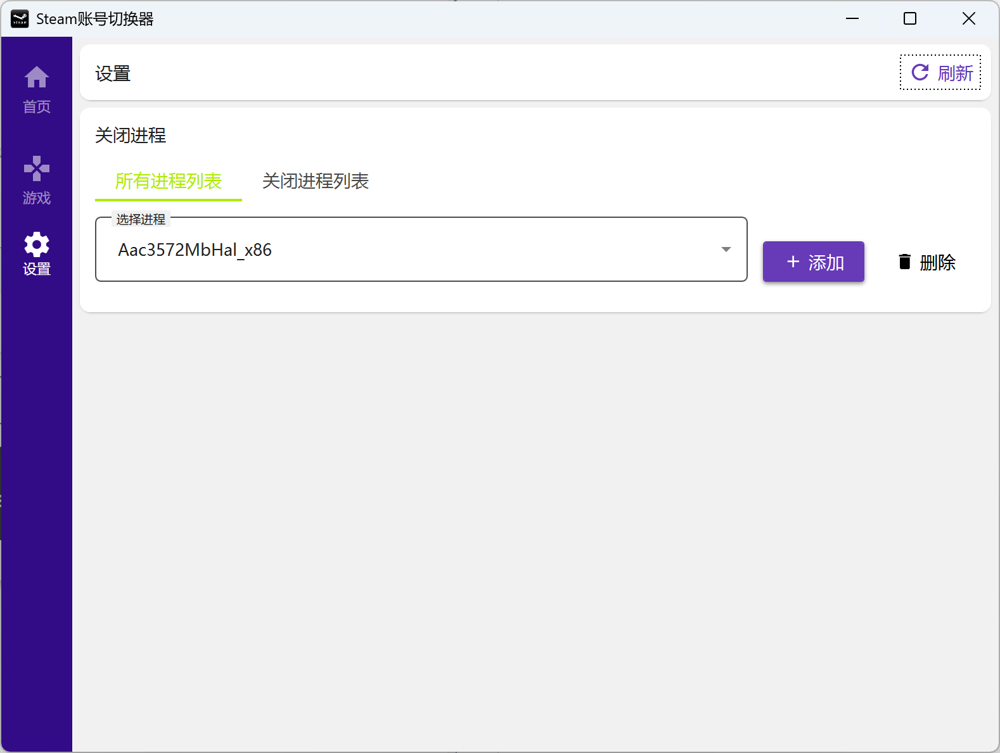
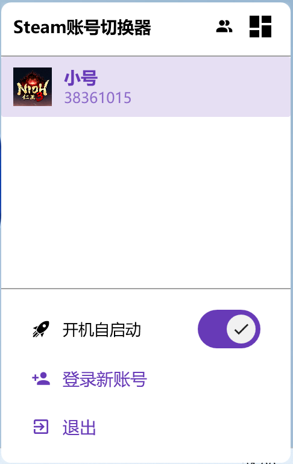

# SteamHub

**开发的起因**: 别人的工具我不敢用,怕有私货,所以开发了这个工具。代码完全开源,您也可以自己编译。

📸 界面预览(点击展开)

### 账号管理

### 游戏库

### 设置

### 系统托盘

## 📋 功能概览

SteamHub 是一个 Steam 多账号管理工具,帮助您快速切换账号、管理游戏库,无需每次手动输入账号密码。

## 1️⃣ 账号管理

- **"刷新** ：程序会自动读取 Steam 本地文件,识别所有登录的账号和已安装的游戏
- 双击账号卡片即可启动账号
- 拖拽排序: 拖动账号卡片可调整显示顺序
- 删除记录: 右键选择"删除",可从列表中移除账号(不影响 Steam 本地文件)

## 2️⃣ 游戏管理

- 程序会自动分析每个账号的游戏记录,将游戏关联到**最后一次游玩**的账号
- 双击游戏卡片即可启动游戏
- **智能切换**: 如果当前登录的账号与游戏所属账号不一致,程序会:
  1. 先自动切换到游戏所属账号
  2. 再启动游戏
- 拖拽排序: 拖动游戏卡片可调整显示顺序

## 3️⃣ 进程管理

- 切换账号前,可以自动关闭指定的进程
- 在 **"设置"** 中管理进程列表:
  - 从系统运行中的进程列表选择

## 4️⃣ 系统托盘

- **双击托盘图标**: 显示主窗口
- **右键托盘图标**: 
  - **快速切换账号**
  - **登录新账号**
  - **设置开机自启动**
  - 退出程序

## 5️⃣ 常见问题 (FAQ)

### Q: 点击"刷新"后没有显示账号?
**A**: 请确认:
- 已正确安装 Steam
- 至少登录过一次 Steam

### Q: 游戏列表显示不全?
**A**: 只有**已安装**的游戏才会显示

### Q: 如何删除不用的账号?
**A**: 右键账号卡片 → "删除",仅从 SteamHub 列表中移除,不影响 Steam 本地数据

### Q: 密码安全吗?
**A**: 密码仅保存在本地 SQLite 数据库,**不会上传到任何服务器**。代码完全开源,您可以自行审查。

## 6️⃣ 快捷操作

| 操作 | 方法 |
|------|------|
| 切换账号 | 双击账号卡片 / 托盘菜单选择账号 |
| 启动游戏 | 点击游戏卡片 |
| 复制账号信息 | 右键账号卡片 → "复制用户名/密码" |
| 刷新数据 | 工具栏 → "刷新" |
| 编辑账号 | 右键账号卡片 → "编辑" |
| 显示主窗口 | 双击托盘图标 |

## 💡 使用建议

1. **首次使用**: 点击"刷新"获取账号和游戏,然后为常用账号保存密码
2. **日常使用**: 通过托盘菜单快速切换账号,无需打开主窗口
3. **多账号游戏**: 启动游戏时会自动切换到对应账号,非常方便
4. **进程管理**: 如果切换账号时遇到问题,可以在设置中添加需要关闭的进程